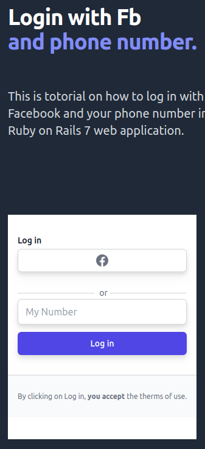

# Log In with Facebook and Phone Number

<!-- PROJECT LOGO -->
<div align="center">
  <a href="https://github.com/DeVuDeveloper/login-fb-phone">
    
  </a>

  <h1 align="center">Log In with Facebook and Phone Number</h1>

  <p align="center">
   
  <a href="https://github.com/DeVuDeveloper/login-fb-phone/#readme"><strong>Explore the docs*»</strong></a>
    <br />
    <br />
    ·
    <a href="https://github.com/DeVuDeveloper/login-fb-phone/issues/1">Report Bug</a>
    ·
    <a href="https://github.com/DeVuDeveloper/login-fb-phone/issues/1">Request Feature</a>
  </p>
</div>

## Screenshot

## 


## Description 🏗️

This is an example of how to log into a Ruby on Rails application with Facebook and a phone number, using the code sent via SMS as authentication. Ruby on rails best practices, how to use linter and how to create a good yml file for Github actions and rebasing commits are also explained.
I wrote a detailed explanation in a tutorial that consists of three parts.
1. part "Login with Facebook and phone number- Ruby on Rails 7 "([here](https://medium.com/@dejanvu.developer/login-with-facebook-and-phone-number-ruby-on-rails-7-83b4e484fb35)).
2. part "Refactor code according to Ruby on Rails best practices" ([here](https://medium.com/@dejanvu.developer/refactor-code-according-to-ruby-on-rails-best-practices-b0adef92d851)).
3. part "Linter and GitHub actions" ([here](https://medium.com/@dejanvu.developer/linter-and-github-actions-fd8daa9b624b)).

<p align="right">(<a href="#top">back to top</a>)</p>

## Live Demo

([Live preview]())

## Getting Started 🏁

### Prerequisites and Dependencies 📜

You will be needing:

- A terminal terminal
- A code editor
- Ruby (follow the instructions based on your OS)
  ```bash
  https://www.ruby-lang.org/en/documentation/installation/
  ```
- Rails (follow the instructions based on your OS)

  ```bash
  https://guides.rubyonrails.org/getting_started.html#creating-a-new-rails-project-installing-rails
  ```

- Postgresql (follow the instructions based on your OS)
  ```bash
  https://www.postgresql.org/download/
  ```

### Clone this repository

```bash
git clone https://github.com/DeVuDeveloper/login-fb-phone.git
```

### Move into the cloned directory with

```bash
cd login-fb-phone

```

## Setup

Install gems with:

```bash
bin/rails/setup
```

Next run:

```bash
npm install
```

### Run linter

For standard:

```bash
rake standard
```
For Tailwind CSS:

```bash
npm run lint
```

#### Auto-correct

In auto-correct mode, Standard linters offenses will be automatically fixed:

For standard:

```bash
rake standard:fix
```

For Tailwind CSS:

```bash
npm run lint:fix
```

### Run Project

Start server with:

```bash
bin/dev
```

This will start a foreman at:

```bash
localhost:3000
```

You can paste or type it on url bar

## Built With 🔨

<div align="center">

|     | Languages                                                                                                                                                                                                                                                                                                                  |     |
| --- | -------------------------------------------------------------------------------------------------------------------------------------------------------------------------------------------------------------------------------------------------------------------------------------------------------------------------- | --- |
|     |  |

<div align="center">


|     | Tools 🛠️                                                                                                                                                                                                                                                                                                                                                                                                                                                                              |     |
| --- | ------------------------------------------------------------------------------------------------------------------------------------------------------------------------------------------------------------------------------------------------------------------------------------------------------------------------------------------------------------------------------------------------------------------------------------------------------------------------------------- | --- |
|     |     |     |

<p align="right">(<a href="#top">back to top</a>)</p>
</div>

## Authors ✍️

<div align="center">

| 👤 DeVuDeveloper|
| -------- |

| <a target="_blank" href="https://github.com/DeVuDeveloper"></a> <a target="_blank" href="https://www.linkedin.com/in/devuj/"></a> <a target="_blank" href="https://twitter.com/DejanVuj"></a>
|

</div>

<p align="right">(<a href="#top">back to top</a>)</p>

## 🤝 Contributors

Contributions, issues, and feature requests are greatly appreciated!

If you have a suggestion that would make this better, please fork the repo and create a pull request. You can also simply open an issue with the tag "improvements".

- Fork the Project
- Create your Feature Branch (git checkout -b feature/yourfeaturename)
- Commit your Changes (git commit -m 'Add suggested feature')
- Push to the Branch (git push origin feature/AmazingFeature)
- Open a Pull Request

Feel free to check the [issues page](https://github.com/DeVuDeveloper/login-fb-phone/issues/1).

<p align="right">(<a href="#top">back to top</a>)</p>

## 📝 License

This project is licensed by [](LICENSE)

## Show your support 💪

Give a ⭐️ if you like this project!

<p align="right">(<a href="#top">back to top</a>)</p>